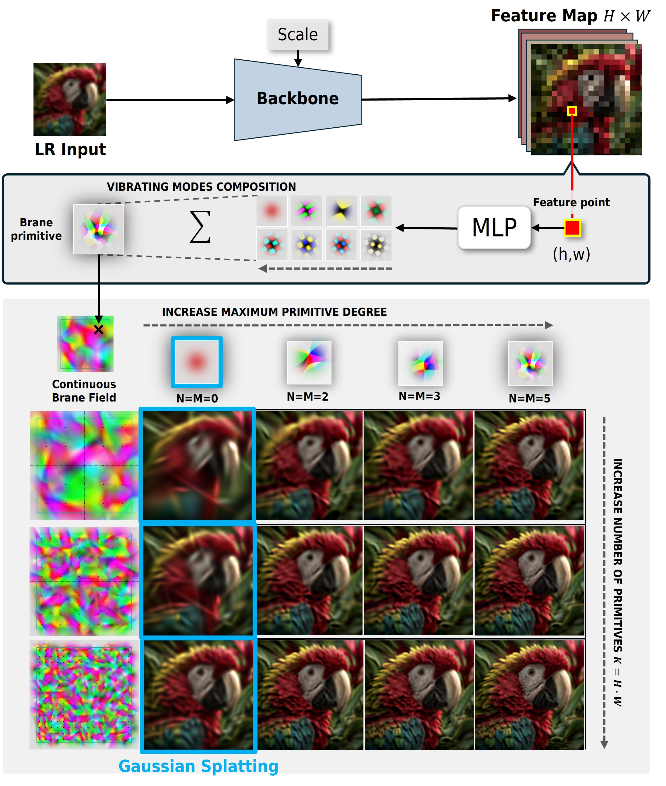

<p align="center">
  
</p>

<h1 align="center">
  Resonant Brane Splatting<br/>
  <sub>for Arbitrary-Scale Super-Resolution</sub>
</h1>

<p align="center">
  <a href="https://arxiv.org/abs/2606.29453">
    
  </a>
  <br>
  <i>* This paper is currently under peer review *</i>
</p>

**Resonant Brane Splatting (RBS)** is a highly efficient, feed-forward framework for Arbitrary-Scale Super-Resolution (ASR). It overcomes the rendering bottlenecks of standard 2D Gaussian Splatting by introducing **Branes**—expressive primitives augmented with Gaussian-Hermite modes that naturally model complex textures and sharp edges within a single footprint. Supported by a custom, fully differentiable rasterizer with advanced culling, RBS requires far fewer overlapping primitives, delivering superior reconstruction quality and a state-of-the-art speed-quality trade-off.


<p align="center">
  
</p>

---

## 📋 Table of Contents

- [Environment Setup](#-environment-setup)
- [Installation](#-installation)
- [Download Checkpoints](#-download-checkpoints)
- [Inference](#-inference)
  - [Single Image](#single-image-inference)
  - [DIV2K Benchmark](#div2k-cropped-benchmark)
- [Quality Metrics](#-quality-metrics-evaluation)
  - [PSNR & SSIM](#psnr--ssim)
  - [LPIPS](#lpips)
  - [DISTS](#dists)

---

## 🐍 Environment Setup

Create and activate a dedicated Conda environment with **Python 3.11**:

```bash
conda create -n rbs_env python=3.11 -y
conda activate rbs_env
```

---

## ⚙️ Installation

### 1 — Install PyTorch

> Adjust the `--index-url` to match your local CUDA version. The example below targets **CUDA 12.4**:

```bash
pip install torch torchvision torchaudio --index-url https://download.pytorch.org/whl/cu124
```

### 2 — Install project dependencies

```bash
pip install -r requirements.txt
pip install -e .
```

### 3 — Build the CUDA Brane Rasterizer

```bash
cd utils/brane_utils
python setup_branecuda.py install
```

---

## 📦 Download Checkpoints

Use [`gdown`](https://github.com/wkentaro/gdown) to fetch the pre-trained weights from Google Drive.

### EDSR backbone — `RBS_v8`

```bash
gdown 1icbigtNcfQnFqySFXcdpamzOkwywLRZm -O checkpoints/EDSR_rbs_v8.ckpt
```

### RDN backbone — `RBS_v7`

```bash
gdown 1i7bC6Lid1_q-VW9r-XQca4nCIh5OuSqO -O checkpoints/RDN_rbs_v7.ckpt
```

---

## 🚀 Inference

### Single Image Inference

**Step 1** — Place your low-resolution image in a folder.
A sample image is already included at:

```
data/demo_lr_images/parrot.jpg
```

**Step 2** — Run inference (example with `RDN_rbs_v7`, scale ×2):

```bash
CUDA_VISIBLE_DEVICES=5 python inference/evaluate_inference.py \
    --path_to_lr_image   ./data/demo_lr_images/parrot.jpg \
    --scale_to_evaluate  2 \
    --results-dir        ./results \
    --ckpt_path          ./checkpoints/RDN_rbs_v7.ckpt \
    --model_name         RBS_v7
```

---

### DIV2K Cropped Benchmark

> This benchmark uses **720×720 centre-cropped** DIV2K images to measure inference speed and GPU memory usage.
> It is **not** an official benchmark — use the official DIV2K benchmark for paper comparisons.

**Step 1** — Download and extract the benchmark dataset:

```bash
gdown 1k1F2OnCyi_Z0_kJCcocGGAAbJNUW7bBG -O data/benchmarks/DIV2K_720_cropped_benchmark.zip

unzip data/benchmarks/DIV2K_720_cropped_benchmark.zip \
      -d data/benchmarks/DIV2K_720_cropped_benchmark
```

**Step 2** — Run benchmark inference (example with `EDSR_rbs_v8`, scale ×4):

```bash
CUDA_VISIBLE_DEVICES=5 python inference/evaluate_inference.py \
    --path_to_image_dataset ./data/benchmarks/DIV2K_720_cropped_benchmark/DIV2K \
    --scale_to_evaluate     4 \
    --results-dir           ./results \
    --ckpt_path             ./checkpoints/EDSR_rbs_v8.ckpt \
    --model_name            RBS_v8
```

> **📝 Note:** All paper results were obtained on a single **NVIDIA H100** GPU.

---

## 📊 Quality Metrics Evaluation

The examples below use the outputs from the DIV2K cropped benchmark.
`--gt` points to the **ground-truth** images; `--restored` to the **model predictions**.

### PSNR & SSIM

```bash
python inference/evaluate_metrics.py \
    --gt        data/benchmarks/DIV2K_720_cropped_benchmark/DIV2K/x4/GT \
    --restored  results/DIV2K/x4 \
    --scale     4
```

### LPIPS

```bash
python inference/evaluate_metrics_lpips.py \
    --gt        data/benchmarks/DIV2K_720_cropped_benchmark/DIV2K/x4/GT \
    --restored  results/DIV2K/x4 \
    --scale     4
```

### DISTS

```bash
python inference/evaluate_metrics_dists.py \
    --gt        data/benchmarks/DIV2K_720_cropped_benchmark/DIV2K/x4/GT \
    --restored  results/DIV2K/x4 \
    --scale     4
```

| Argument | Description |
|---|---|
| `--gt` | Path to ground-truth HR images |
| `--restored` | Path to super-resolved (predicted) images |
| `--scale` | Upscaling factor used during inference |

---

## 🗂️ Project Structure (quick reference)

```
.
├── checkpoints/          # Pre-trained model weights
├── data/
│   ├── demo_lr_images/   # Sample LR input images
│   └── benchmarks/       # Downloaded benchmark datasets
├── inference/
│   ├── evaluate_inference.py
│   ├── evaluate_metrics.py
│   ├── evaluate_metrics_lpips.py
│   └── evaluate_metrics_dists.py
├── utils/
│   └── brane_utils/      # CUDA rasterizer source & setup
├── requirements.txt
└── setup.py
```

---

## 📌 Quick-Reference: Model & Checkpoint Table

| Model Name | Backbone | Checkpoint File 
|---|---|---|
| `RBS_v7` | RDN | `RDN_rbs_v7.ckpt` |
| `RBS_v8` | EDSR | `EDSR_rbs_v8.ckpt` |


---

## 📜 Citation

If you find this code or research useful, please consider citing our paper:

```bibtex
@misc{federico2026resonantbranesplattingarbitraryscale,
      title={Resonant Brane Splatting for Arbitrary-Scale Super-Resolution}, 
      author={Giulio Federico and Giuseppe Amato and Claudio Gennaro and Fabio Carrara and Marco Di Benedetto},
      year={2026},
      eprint={2606.29453},
      archivePrefix={arXiv},
      primaryClass={cs.CV},
      url={[https://arxiv.org/abs/2606.29453](https://arxiv.org/abs/2606.29453)}, 
}
